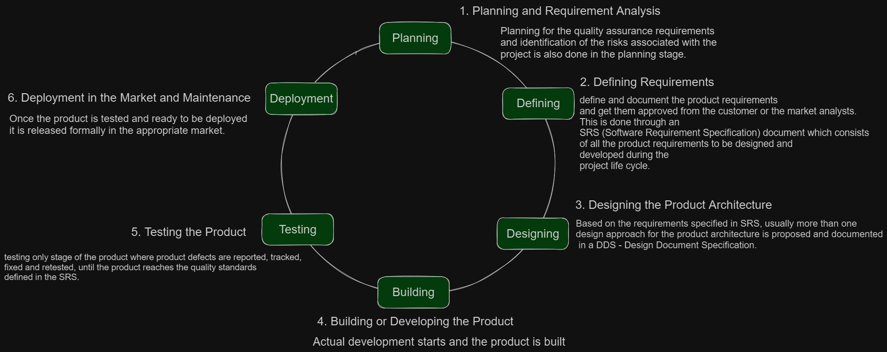
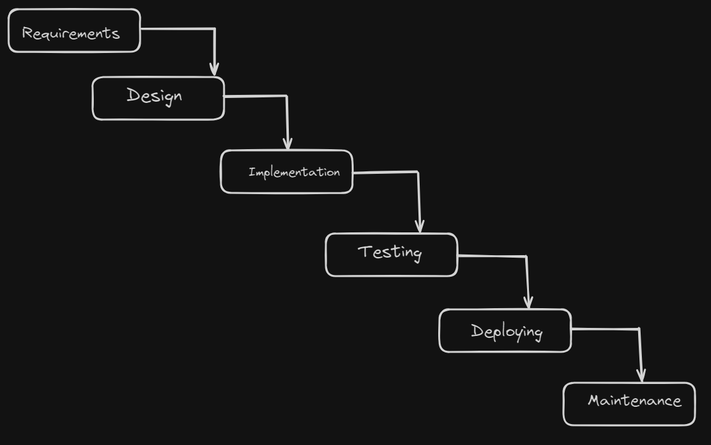
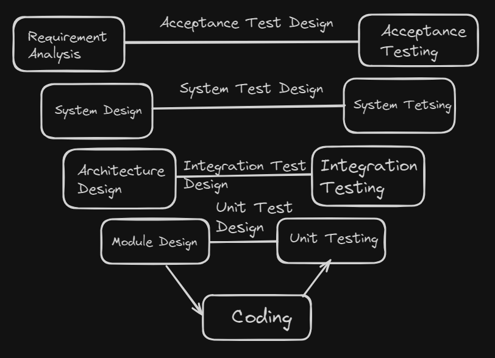
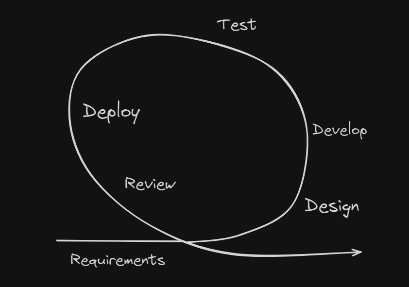

<!-- markdownlint-disable MD033 -->
# Content of Table

- [Software Development Life Cycle (SDLC) Models](#software-development-life-cycle-sdlc-models)

## Software Development Life Cycle (SDLC) Models

**Explanation:**

Software Development Life Cycle (SDLC) models are methodologies that guide the process of developing software.

    
Key Concepts:

1. **Process-oriented:** This approach focuses on the process of developing software, with an emphasis on planning, time schedules, target dates, budgets, and implementation of an entire system at one time.

2. **Sequential SDLC Model:** This is a type of SDLC model where development is seen as flowing steadily downwards through several phases.

    - **Waterfall Model:**

      **Explanation:**

      Waterfall Model, is a linear approach to software development.

      

    - **V-Shaped Model:**

      **Explanation:**

      Every single phase in the development cycle, there is a directly associated testing phase.

      

      **Key Concepts:**

      - **Verification:** Regularly evaluate intermediary work products during the software development lifecycle to ensure that you're on the right track. This could involve code reviews, design reviews, or reviewing other documentation.

      - **Validation:** Once the final product is ready, compare it to the user’s requirements to ensure that it meets the specified requirements. This could involve user acceptance testing or beta testing.

3. **Iterative and Incremental SDLC Model:** This is a type of SDLC model where the software is developed incrementally and the development process is repeated in small iterations.

    - **Agile Model:**

      **Explanation:**

     Agile methodologies, the development process is iterative and incremental. This means that the software is developed in small, manageable increments, with each iteration building upon the previous one.

      **Key Concepts:**

      1. **Agile Manifesto:** The Agile Manifesto is a document that outlines the key values and principles of Agile development.

          - **Individuals and interactions** over processes and tools
          - **Working software** over comprehensive documentation
          - **Customer collaboration** over contract negotiation
          - **Responding to change** over following a plan

      2. **Scrum:** Scrum is a framework that emphasizes iterative progress through sprints. It is also a management tool that allows stakeholders to see progress.

      

4. **Roles in Software Development:** These are the different roles involved in the software development process, each with specific responsibilities and tasks.

    - **Project Manager**
    - **Software Developer**
    - **Quality Assurance Tester**
    - **Business Analyst**
    - **Stakeholders**

